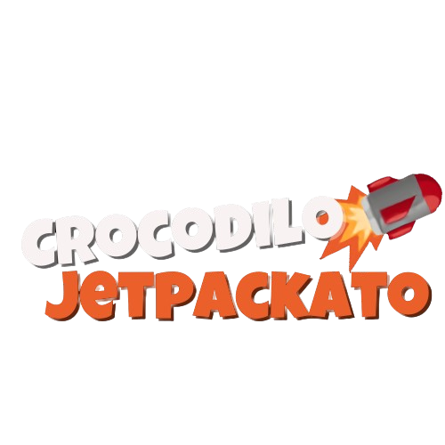
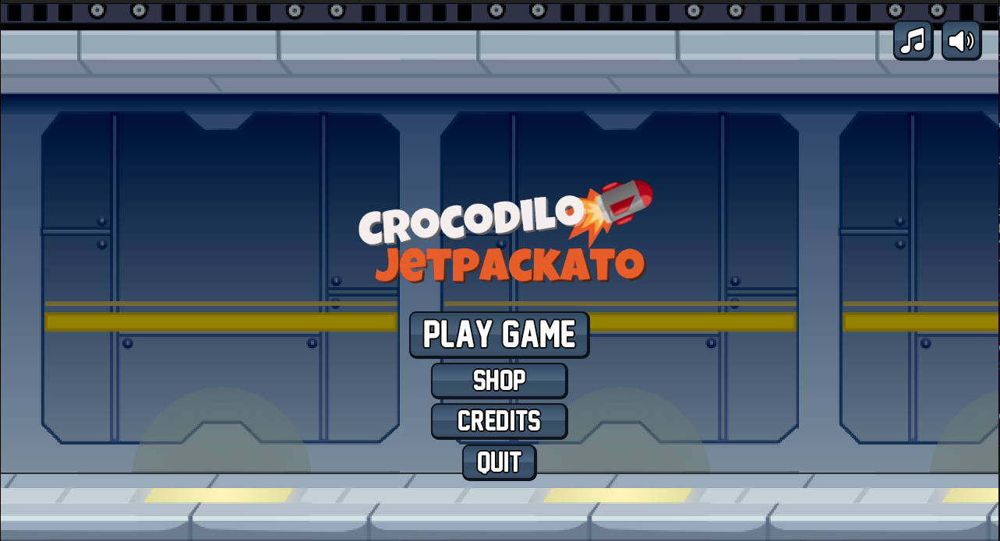
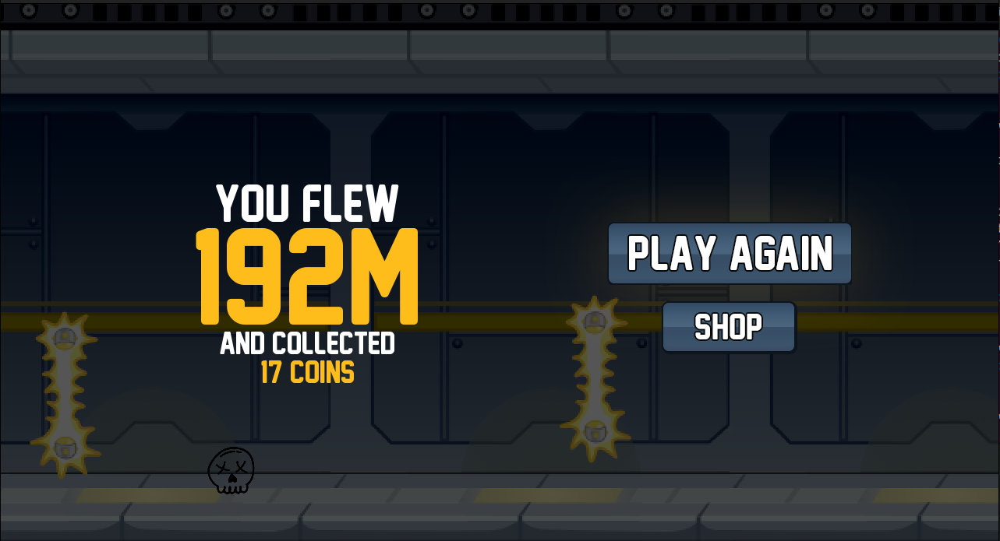
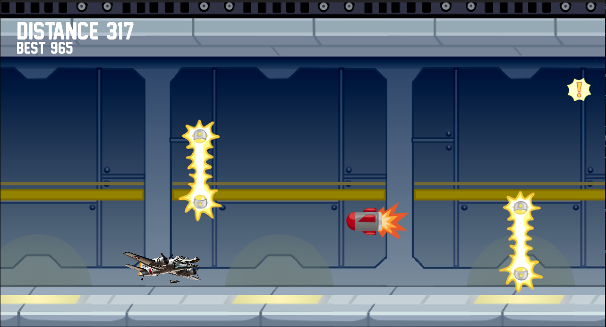
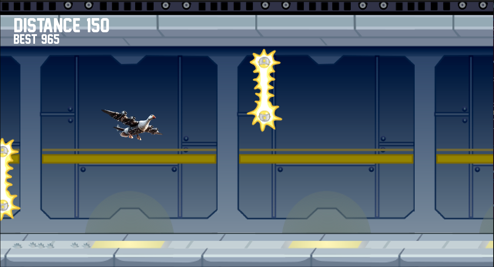

**Crocodilo Jetpackato** is a fun, fast-paced 2D side-scrolling game inspired by Jetpack Joyride, built using **Pygame**. You play as **Bombardino Crocodilo** dodging missiles and laser obstacles while collecting coins in an endless run through a high-tech lab.

[Demo video]()

 

***

## Screenshots
<table>
  <tr>
    <td></td>
    <td></td>
  </tr>
  <tr>
    <td></td>
    <td></td>
  </tr>
</table>

 

## Controls
<table>
  <tr>
    <td><b>Key</b></td>
    <td><b>Action</b></td>
  </tr>
  <tr>
    <td>W</td>
    <td>Fly</td>
  </tr>
  <tr>
    <td>Esc</td>
    <td>Pause</td>
  </tr>
</table>

 

## How to run the game:

1) Clone the repository.
2) Install Python 3.8.8 or higher.
3) Install the packages in <b>requirements.txt</b>, using the following command in the terminal in the game folder: <b>pip install -r requirements.txt</b>
4) Run main.py file using <b>python main.py</b> in terminal.

 

## Credits

New Athletic M54 font by **justme54s**. \
https://www.dafont.com/new-athletic-m54.font

Soundtrack by **dos88**. \
https://dos88.itch.io/dos-88-music-library

Go checkout the real **Jetpack Joyride**! \
https://play.google.com/store/apps/details?id=com.halfbrick.jetpackjoyride&hl=en_IN&pli=1